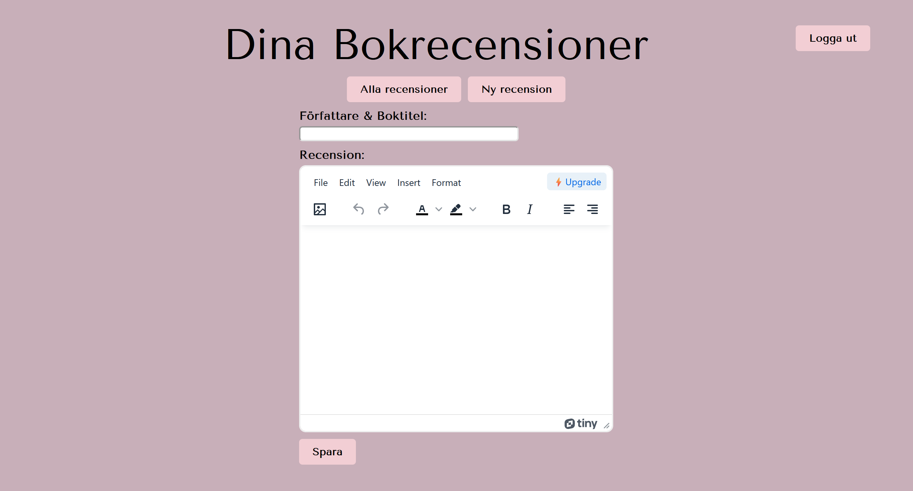
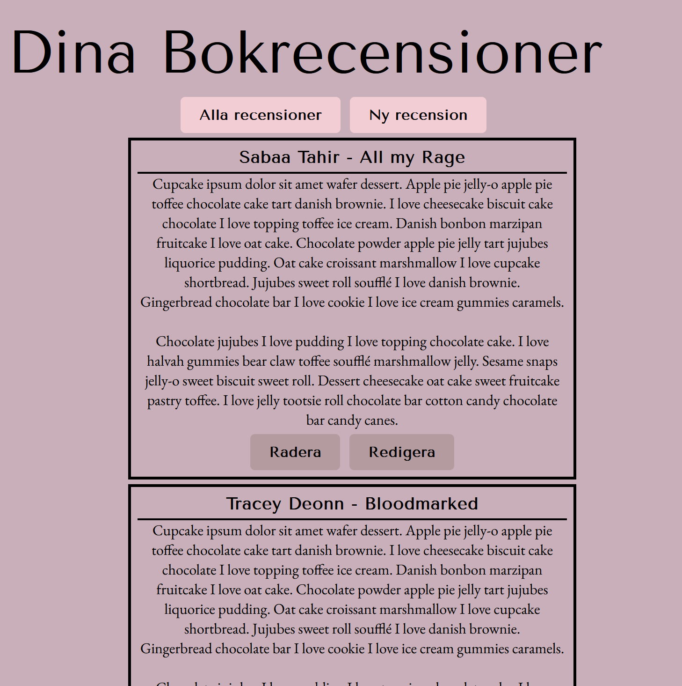

# About this project
This project was an assignment in our API-course where the premise was to create a system
to a client that wanted to be able to create his/hers own digital documents. Since 
I love books I decided to create a page for book reviews. 

The client wanted functionalities such as:

* Being able to log in
* See a list of all the documents when logged in
* Be able to create new documents, edit them and delete them

The project is a headless application and the backend is using the MySQL database,
Express and Node.js. The frontend side is using Javascript, HTML and CSS. For the editor
the project uses the tinyEMC editor. 

## Author
[helenaskagerlid](https://github.com/helenaskagerlid)

## How to start this project
* Start by cloning this repository on github
* In your terminal type npm install
* To start server use npm start
* Details for the database

## Database details
* database: noteshelena
* host: localhost
* port: 3306
* user: notesHelena
* password: notes2024!

## Screenshots of the project

